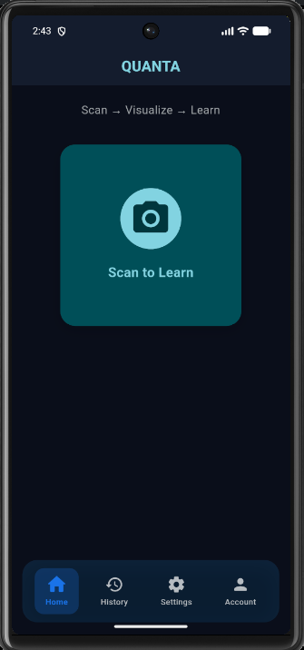
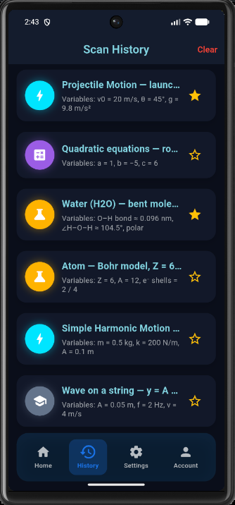
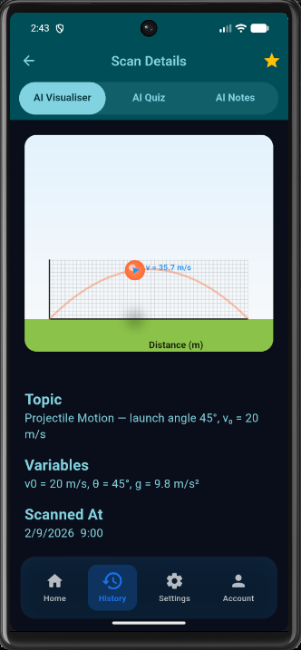
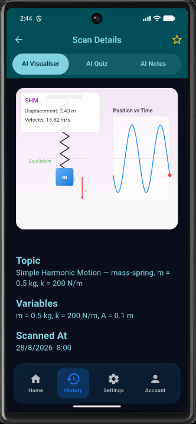
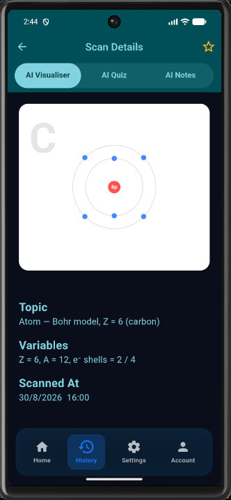
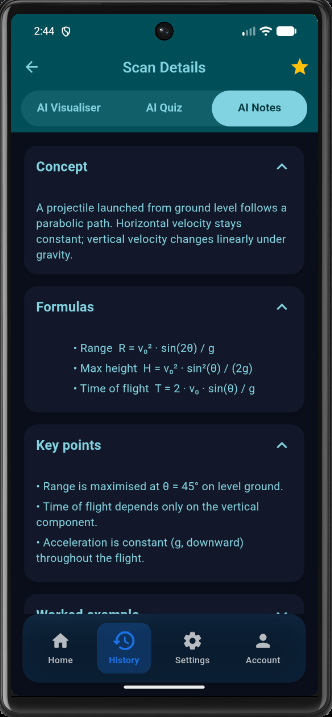
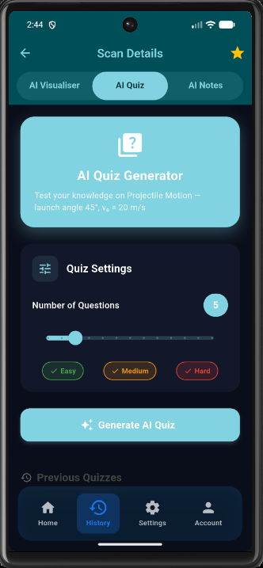
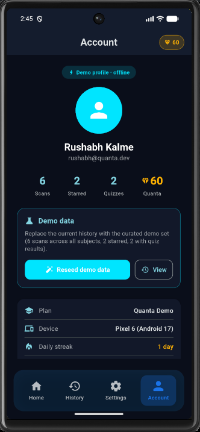

# Quanta

> **🏆 Gryffindor — iQOO Hackathon 2026 (Smart Education track)**
> Scan a textbook page. Get the diagram, the notes, and a quiz — in under thirty seconds.

Quanta turns a photo of a STEM problem into three things you can actually use:
an **interactive diagram**, **revision notes**, and a **five-question quiz**.
Built phone-first, runs offline once you've scanned, remembers everything
you've ever asked it about.

---

## 📱 See it in action

The whole user journey, in eight screens:

<table>
  <tr>
    <td align="center" width="25%">
      <br />
      <b>1 · Home</b><br />
      <sub>One tap to start a scan.</sub>
    </td>
    <td align="center" width="25%">
      <br />
      <b>2 · History</b><br />
      <sub>Every scan you do is saved on the phone.</sub>
    </td>
    <td align="center" width="25%">
      <br />
      <b>3 · Visualiser · Projectile</b><br />
      <sub>Parabola with live velocity vector at the apex.</sub>
    </td>
    <td align="center" width="25%">
      <br />
      <b>4 · Visualiser · SHM</b><br />
      <sub>Spring with position-vs-time graph.</sub>
    </td>
  </tr>
  <tr>
    <td align="center" width="25%">
      <br />
      <b>5 · Visualiser · Atom</b><br />
      <sub>Bohr model with the right number of electrons per shell.</sub>
    </td>
    <td align="center" width="25%">
      <br />
      <b>6 · Notes</b><br />
      <sub>The same problem, expanded: formulas, gotchas, worked example.</sub>
    </td>
    <td align="center" width="25%">
      <br />
      <b>7 · Quiz Generator</b><br />
      <sub>Five multiple-choice questions, scored live.</sub>
    </td>
    <td align="center" width="25%">
      <br />
      <b>8 · Account &amp; Coins</b><br />
      <sub>Quanta coins for the loop; streaks for the habit.</sub>
    </td>
  </tr>
</table>

> Twelve more captures in [`screenshots/`](screenshots/) — the sine-wave
> visualiser, the demo-data seed, and the camera-capture screen.
> Demo recordings will go in [`video/`](video/).

---

## ✨ Inspiration

You're on the bus. You have twenty minutes and three chapters of
projectile motion to revise. You don't want to watch a video. You
don't want to read a wall of text. You want to look at the diagram,
remember the formula, and check that you can solve the problem.

Most "AI study" apps are chat wrappers. We wanted something you could
poke at — drag a slider, watch the parabola change, fail a quiz, try
again. The phone is the right device for that, and the camera is the
right sensor.

---

## 🚀 What it does

1. **Snap a photo** of a worked example in your textbook.
2. **The phone reads the page** with on-device OCR (Google ML Kit), so
   the image never leaves your hand until you tap submit.
3. **Quanta picks the right visualiser** — projectile motion, Bohr
   atom, sine wave, free fall, equation plotter, or a generic diagram.
4. **You get three things on one screen:**
   - 📊 **AI Visualiser** — an interactive diagram with sliders that
     re-render the simulation live.
   - 📝 **AI Notes** — the concept, the formulas, the gotchas, and the
     worked example in expandable cards.
   - ❓ **AI Quiz** — five multiple-choice questions, scored immediately.
5. **Everything is saved on your phone** — the History tab works
   without internet. A small **Quanta coin** keeps the loop going.

---

## 🛠️ How we built it

| Layer | Tech | What it does |
|---|---|---|
| **Mobile** | Flutter 3.x, Dart 3.9 | Cross-platform client, hand-written `CustomPainter` widgets for every visualisation |
| **On-device** | `google_mlkit_text_recognition` | OCR runs on the iQOO's NPU; no cloud round-trip for the image |
| **Backend** | Python 3.14, FastAPI, MongoDB | Topic detection, visualiser template dispatch, AI generation |
| **AI** | Gemini 2.5 Flash | Notes, quiz, and visualiser parameter fill-in |
| **Auth** | Firebase ID tokens | User-scoped scans; dev bypass for local runs |
| **Bridge** | iQOO Office Kit | Phone ↔ laptop screen mirror, clipboard, file transfer during the build |

Every visualiser is a Flutter widget. No remote canvas, no third-party
chart library. Drag a slider on the projectile widget and you can watch
the parabola redraw at 60 fps.

There's a deeper write-up in [ARCHITECTURE.md](ARCHITECTURE.md) — system
diagrams, data shapes, the visualiser dispatch rules, why we made each
choice.

---

## 🏃 Run it locally

```bash
git clone https://github.com/JustRK-07/quanta.git
cd quanta
make dev
```

That brings up the backend on `http://localhost:8001` and the Flutter
app. Open the app, point it at any physics, chemistry, or maths problem
in a textbook, and tap **Scan to Learn**. The full loop — capture, OCR,
visualiser, notes, quiz, history — runs in under a second on a recent
Android phone.

Want one side only?

```bash
# Backend
cd backend
python3.14 -m venv .venv && . .venv/bin/activate
pip install -r requirements.txt
ALLOW_DEV_AUTH_BYPASS=true .venv/bin/uvicorn main:app --port 8001

# App
cd quanta_app
flutter pub get
flutter run --dart-define=ALLOW_DEV_AUTH_BYPASS=true
```

## ☁️ Hackathon deployment

The repository is intended to be a Flutter client plus a FastAPI backend.
At present, this checkout contains only the backend documentation and runtime
uploads; the Python source and deployment manifests are not present. Do not
attempt a full-stack deployment from this checkout until those files are
restored from the authoritative source repository.

Once the backend source is available, deploy the two components separately:

1. Create a free MongoDB Atlas database and copy its driver URI into the
   backend's `MONGO_URI` environment variable.
2. Deploy the complete `backend/` directory to Render, Railway, or another
   Python host. Use `uvicorn main:app --host 0.0.0.0 --port $PORT` as the
   start command and set the    provider key required by the backend (`GOOGLE_API_KEY` for Gemini or
   `GROQ_API_KEY` for Groq), Firebase credentials, `MONGO_URI`, and
   `FRONTEND_URL` as platform secrets.
3. Deploy `quanta_app/` to Vercel or Firebase Hosting. Build with:

   ```bash
   flutter build web --release \
     --dart-define=QUANTA_API_BASE_URL=https://your-backend.example.com
   ```

   `QUANTA_API_BASE_URL` is used by every Flutter screen that calls the API.
   The default `http://10.0.2.2:8001` is only for an Android emulator.
4. For production, configure Firebase Authentication and set
   `ALLOW_DEV_AUTH_BYPASS=false` (or leave it unset). Never commit `.env`,
   Firebase service-account files, or API keys.

The optional provider-key screen in the Flutter client is suitable only for
local demos: any key entered there is necessarily available to the client.
Production AI calls must use backend-managed provider credentials instead.

The backend source files must be present in `backend/` before deployment.
The repository's deployment configuration cannot build an API from the
documentation alone. Never copy secrets into the repository; configure
`GOOGLE_API_KEY`, Firebase Admin credentials, `MONGO_URI`, and
`ALLOW_DEV_AUTH_BYPASS` in the hosting provider's environment settings.

The dev bypass means the app talks to the local backend without needing
a Firebase project. For a production deploy, follow
[quanta_app/FIREBASE_SETUP.md](quanta_app/FIREBASE_SETUP.md).

---

## 🧗 Challenges we ran into

- **OCR is hard on handwritten equations.** ML Kit is great on printed
  text, less so on cursive. We treat the OCR as a hint — the user can
  edit the extracted text before submitting.
- **The visualiser dispatch has to be deterministic.** A misclassified
  topic meant an empty screen. We added a hardcoded keyword fallback
  in `routers/visualiser.py` that always picks *something* sensible.
- **The demo placeholder image was a blue box.** The History detail
  screen tried to render an empty placeholder path as a real image.
  Fixed by detecting `/demo_scans/` paths and skipping the image widget.
- **Dev auth without a Firebase project.** The phone's Firebase
  service returns a `test-token` constant when no user is signed in,
  and the backend accepts it when `ALLOW_DEV_AUTH_BYPASS=true`. Full
  loop, zero external services.

---

## 🏅 Accomplishments

- **The whole product loop was demonstrated** during the hackathon with the
  original backend source and local configuration. This checkout is not a
  fresh-clone full-stack deployment until that source is restored.
- **Twelve hand-written visualiser widgets** that all redraw at 60 fps
  on parameter changes.
- **Local-first history** — the History tab works on a flight.
- **Built on the loaner iQOO** in 30 hours, with Office Kit as the
  primary build tool during Red Light.

---

## 🔮 What's next

- **On-device topic classification** — a quantised model on the phone
  so the backend round-trip is optional.
- **More visualisers** — optics, circuits, organic chemistry molecules,
  vector geometry, 3D coordinate geometry.
- **Cross-device sync** — Firestore rules + conflict-free history merge.
- **i18n** — Hindi, Marathi, Tamil, Telugu, Kannada translations of
  the notes.
- **Accessibility pass** — TalkBack labels, dynamic type, high-contrast
  palette.
- **A real LMS hook** — class assignment, teacher dashboard, progress
  tracking. (For when the iQOO weekend is over.)

The full roadmap is in [CHANGELOG.md](CHANGELOG.md) and
[ISSUES.md § 8](ISSUES.md#8--currently-open-themes).

---

## ⚙️ Built with

<p>
  
  
  
  
  
  
  
  
</p>

---

## 👥 Team Gryffindor

Built at **Vishwakarma Institute of Technology Pune**.

| | |
|---|---|
| **Dakshin** | Backend and full-stack |
| **Nihith** | Flutter and visualisation |
| **Shreram** | AI services and quiz generation |
| **Vibin** | Design and product |

Reach us on the WhatsApp group, the [iQOO Hackathon Discord](https://discord.gg/iqoo-hackathon),
or open an issue.

---

## 📄 License

MIT — see [LICENSE](LICENSE). Copyright © 2025 Quanta Team (Gryffindor),
Vishwakarma Institute of Technology Pune.

---

## 📚 Read next

- [IQOO_SUBMISSION.md](IQOO_SUBMISSION.md) — the one-pager we used at
  the city battle.
- [ARCHITECTURE.md](ARCHITECTURE.md) — system diagram and data shapes.
- [backend/readme.md](backend/readme.md) — backend-specific setup and
  endpoints.
- [quanta_app/README.md](quanta_app/README.md) — Flutter setup and
  project layout.
- [CONTRIBUTING.md](CONTRIBUTING.md) — how to add a visualiser.
