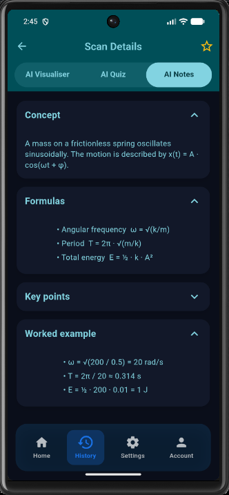
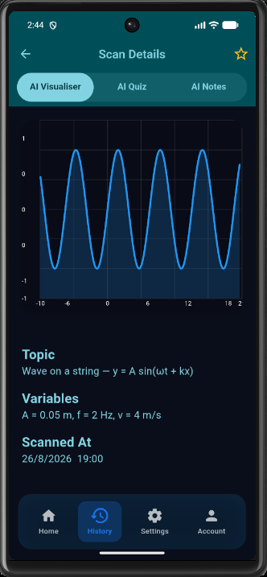

# Quanta — Scan → Visualize → Learn

> **iQOO Hackathon 2026 submission** · Smart Education track
> Point a phone at a physics, chemistry, or maths problem on a textbook page. Quanta recognises the equation, visualises it, and turns it into revision notes and a quick quiz — all on the phone.

[](https://flutter.dev)
[](https://fastapi.tiangolo.com)
[](LICENSE)

---

## The pitch

> *"I want to revise projectile motion but I have three chapters, no internet, and twenty minutes before the bus."*

Quanta is a phone-first STEM learning companion. You snap a photo of a worked example or an equation in a textbook — the app extracts the text **on-device with ML Kit**, sends the snippet to a backend that picks the right template, and hands back three things on the same screen:

1. **AI Visualiser** — an interactive diagram or plot. Projectile motion plays as a parabola with a velocity vector; the Bohr model of carbon shows two shells with the right number of electrons; a wave on a string draws as a real sinusoid.
2. **AI Notes** — the concept, the formulas, the gotchas, and a worked example in expandable cards.
3. **AI Quiz** — five multiple-choice questions, scored immediately, with results stored alongside the scan.

Everything the user has scanned lives in a local **History** tab they can revisit offline. A **Quanta coin** reward system nudges the loop (scan → quiz → earn → scan the next topic).

### Why this fits the iQOO Hackathon

| Rubric | How Quanta scores it |
|---|---|
| **End product quality** (30%) | A working Android build with full flow: scan → OCR → backend → visualiser + notes + quiz → history. |
| **Novelty and impact** (20%) | Textbook OCR + interactive visualisation is rare outside expensive edtech; the loop is built around the iQOO phone's camera and a free on-device model. |
| **HackTracker — creative phone use** (15%) | Camera, on-device OCR via ML Kit, persistent local storage, interactive touch-driven parameters. |
| **Technical depth** (15%) | Custom physics widgets (Canvas, animation controllers), templated visualiser engine, deterministic backend fallback, dev-auth bypass. |
| **HackTracker — Office Kit usage** (10%) | Office Kit wires the phone to a laptop during a build session for live demo, file transfer of the demo build, screen mirror. |
| **Demo and presentation** (10%) | 3–5 minute pitch with the loaner iQOO showing the Scan → Visualise → Notes → Quiz flow. |

---

## See it in action

| Home | Projectile motion | Bohr atom (Z = 6) | AI Notes (SHM) |
|:-:|:-:|:-:|:-:|
|  |  |  |  |

| Wave plot | Notes — projectile | History tab |
|:-:|:-:|:-:|
|  |  | more in `screenshots/` |

> The `screenshots/` folder holds the 12 captures we use for the submission deck.

---

## How it works (the build spine)

```
┌─────────────────────┐        ┌──────────────────────────┐
│  iQOO phone         │  HTTP  │  FastAPI backend         │
│  ───────────        │ ─────► │  ───────────────         │
│  Camera → ML Kit    │        │  • scan router           │
│  (on-device OCR)    │ ◄───── │  • visualiser templates  │
│  Visualiser widgets │  JSON  │  • notes / quiz AI       │
│  (Canvas + Anims)   │        │  • history (Mongo)       │
│  Local history      │        │  • Firebase Auth          │
└─────────────────────┘        └──────────────────────────┘
```

- **On-device** — `google_mlkit_text_recognition` runs the OCR on the iQOO's NPU. The image never leaves the phone until the user taps submit.
- **Backend** — the FastAPI service extracts topics, picks a visualiser template (projectile, atom, SHM, wave, free-fall, generic diagram), generates notes and a five-question quiz, and persists the scan.
- **Phone renderer** — Flutter `CustomPainter` widgets draw the parabola, atom shells, sine wave, etc. Parameter sliders update the simulation in real time.
- **Local-first** — every scan is mirrored to `SharedPreferences`, so the History tab works without a network round-trip.

### Red Light / Green Light

This codebase is built to be edited and demoed **on the iQOO phone**. During Red Light the laptop is reachable only through Office Kit: screen-mirror the IDE, drop new builds over the bridge, drive the device from the trackpad. Green Light is the laptop-and-phone mode we use for the opening sprint, mentor rounds, and demo polish.

---

## Repository layout

```
quanta/
├── quanta_app/             # Flutter mobile client (iOS · Android · Web · macOS · Linux · Windows)
│   ├── lib/
│   │   ├── screens/        # Home, scan, scan_result, history, history_detail, account, settings, login, splash
│   │   ├── visualiser/     # ProjectileMotion, Atom, SHM, Wave, FreeFall, EquationPlotter, GenericDiagram
│   │   ├── storage/        # SharedPreferences-backed history store with seedDemoData()
│   │   ├── services/       # Firebase Auth, Groq/Gemini client
│   │   ├── models/         # ScanHistory, QuizResult, notes
│   │   ├── widgets/        # Bottom nav, badges, coin counter
│   │   └── theme/          # Quanta dark theme + provider
│   ├── assets/             # Inter font, team photos
│   ├── android/ ios/ web/  # Platform scaffolds
│   └── pubspec.yaml
│
├── backend/                # FastAPI service
│   ├── main.py             # App entry, CORS, router mount
│   ├── routers/            # scan · visualiser · history · quiz · notes · chat · users
│   ├── services/           # ai_visualiser · ai_notes · ai_quiz · ai_chat · ai_detector
│   ├── auth/               # Firebase ID-token middleware + dev-bypass shortcut
│   ├── templates/visualiser/   # JSON templates for static topics
│   ├── static/uploads/         # Runtime artefacts (gitignored)
│   ├── requirements.txt
│   └── vercel.json         # Serverless deploy
│
├── .github/
│   ├── workflows/          # backend-ci, flutter-ci, docs-check, stale, labeler, greet-first-timers
│   ├── ISSUE_TEMPLATE/     # bug_report, feature_request, question
│   ├── PULL_REQUEST_TEMPLATE.md
│   ├── SUPPORT.md
│   ├── FUNDING.yml
│   └── dependabot.yml
│
├── docker-compose.yml      # Local stack
├── Makefile                # Common dev tasks
├── .pre-commit-config.yaml
├── .gitignore
├── LICENSE                 # MIT — Quanta Team, Vishwakarma Institute of Technology Pune
└── screenshots/           # Demo captures used in the submission deck
```

---

## Quick start

> Tested on Linux (Arch) with Flutter 3.35 / Dart 3.9 and Python 3.14.

### 1 · Backend

```bash
cd backend
python3.14 -m venv .venv
. .venv/bin/activate
pip install -r requirements.txt

cp .env.example .env         # then add your GOOGLE_API_KEY (Gemini) and Firebase creds
ALLOW_DEV_AUTH_BYPASS=true .venv/bin/uvicorn main:app --host 0.0.0.0 --port 8001 --reload
```

The dev bypass (`ALLOW_DEV_AUTH_BYPASS=true`) lets the phone send `Authorization: Bearer test-token` for local runs — no Firebase project needed.

### 2 · Flutter app

```bash
cd quanta_app
flutter pub get
flutterfire configure        # generate firebase_options.dart against your project
flutter run                  # or: flutter build apk --debug
```

For an Android emulator, the app talks to the backend at `http://10.0.2.2:8001`. For a physical iQOO device, change the URL in `lib/screens/main_screen.dart` to your laptop's LAN IP, or deploy the backend to Vercel and set `_isProduction = true`.

### 3 · One-shot

```bash
make dev       # boot backend + flutter, with logs tailing
make test      # run the test suites
make lint
```

---

## The visualiser widgets

Every visualisation in the app is a Flutter `CustomPainter` driven by a small data model. New topics are added by writing a JSON template and a renderer — no backend rewrite needed.

| Topic | Template | Renderer |
|---|---|---|
| Projectile motion | `projectile_motion.json` | `visualiser/projectile_motion.dart` |
| Simple harmonic motion | `shm.json` | `visualiser/shm_component.dart` |
| Bohr atom | `kinematics.json` (with `topic=atom`) | `visualiser/atom_component.dart` |
| Free fall | `free_fall.json` | `visualiser/free_fall_component.dart` |
| Sine wave / wave-on-string | `kinematics.json` (with `topic=wave`) | `visualiser/graph_component.dart` |
| Equations (algebra) | `graphs.json` | `visualiser/equation_plotter.dart` |
| Fallback | `kinematics.json` | `visualiser/generic_diagram.dart` |

The backend's `services/ai_visualiser.py` looks at the recognised text, picks the closest template, fills in the variables, and the phone renders the widget. Sliders re-render the simulation without re-hitting the network.

---

## Testing

```bash
# Backend
cd backend
.venv/bin/pytest -q

# Flutter
cd quanta_app
flutter test
```

CI runs on every push: `.github/workflows/backend-ci.yml` and `.github/workflows/flutter-ci.yml`.

---

## What's intentionally not in the repo

- **`backend/.env`** — your real `GOOGLE_API_KEY` and Firebase credentials. `.env.example` is the template.
- **`quanta_app/firebase_options.dart`**, **`quanta_app/firebase.json`**, **`quanta_app/android/app/google-services.json`**, **`quanta_app/ios/Runner/GoogleService-Info.plist`** — per-project Firebase config. Generate them locally with `flutterfire configure` against your own project.
- **`backend/static/uploads/`** — runtime user uploads. `static/scans/` and `static/uploads/` are gitignored.
- **`.venv/`, `build/`, `.dart_tool/`, `.gradle/`, `Pods/`** — every local build artefact is ignored.

---

## The team

Built at Vishwakarma Institute of Technology Pune for the **iQOO Hackathon 2026** (Smart Education track).

| | |
|---|---|
| **Dakshin** | Full-stack + backend lead |
| **Nihith** | Flutter + visualisation |
| **Shreram** | AI services + quiz generation |
| **Vibin** | Design + product |

Reach the team at the addresses in `quanta_app/assets/team/` or open an issue.

---

## License

MIT — see [LICENSE](LICENSE). Copyright © 2025 Quanta Team, Vishwakarma Institute of Technology Pune.

## See also

- [ARCHITECTURE.md](ARCHITECTURE.md) — system diagram, data flow, and component responsibilities
- [CONTRIBUTING.md](CONTRIBUTING.md) — dev setup, branch model, PR rules
- [CODE_OF_CONDUCT.md](CODE_OF_CONDUCT.md)
- [SECURITY.md](SECURITY.md) — how to report a vulnerability
- [BRANDING.md](BRANDING.md) — name, voice, and visual identity
- [CHANGELOG.md](CHANGELOG.md) — release notes
- [TESTIMONIALS.md](TESTIMONIALS.md) — early tester feedback
- [ISSUES.md](ISSUES.md) — known issues and the issue triage model
- [backend/readme.md](backend/readme.md) — backend-specific setup
- [quanta_app/FIREBASE_SETUP.md](quanta_app/FIREBASE_SETUP.md) — Firebase project setup
